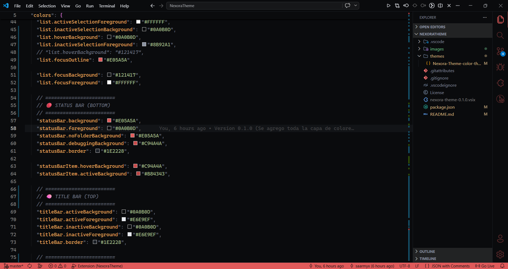
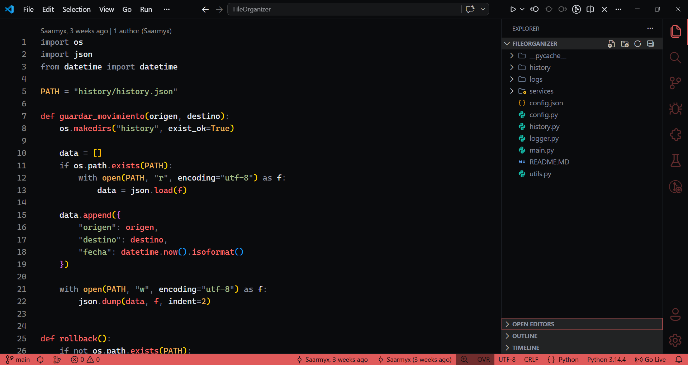
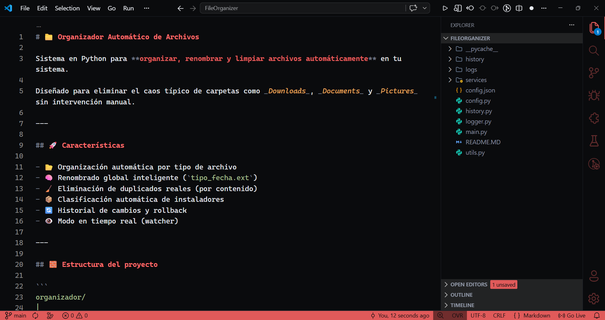

# Nexora Theme

Minimal. Intentional. System-driven.

<!-- [](https://marketplace.visualstudio.com/items?itemName=Nexora.nexora-theme)
[](https://marketplace.visualstudio.com/items?itemName=Nexora.nexora-theme)
[](https://marketplace.visualstudio.com/items?itemName=Nexora.nexora-theme) -->

---

## Preview



---

## 🧠 Philosophy

Nexora is not just a theme.

It is part of a system designed to:

- Reduce visual noise
- Improve focus while coding
- Maintain consistency across tools
- Support structured thinking through design

Every color and contrast decision exists with intention.

---

## 🎨 Design Principles

- **Dark-first** → deep background for focus
- **Soft red accent** → used for structure, not decoration
- **Low saturation palette** → reduces eye fatigue
- **Clear hierarchy** → faster code scanning

---

## ⚙️ Features

- Carefully balanced contrast

- Minimal and distraction-free UI

- Semantic highlighting optimized for:
  - JavaScript / TypeScript
  - React / JSX
  - Python
  - HTML / CSS
  - Markdown

- UI elements aligned with the same system:
  - Buttons
  - Inputs
  - Panels
  - Status bar

---

## 🧩 Focus Areas

### JavaScript / React


### Python



### Markdown



---

## 🚀 Installation

Search for **Nexora Theme** in VS Code
or install directly:

https://marketplace.visualstudio.com/items?itemName=Nexora.nexora-theme

---

## 🧭 Usage

1. Open Command Palette
2. Select `Preferences: Color Theme`
3. Choose **Nexora Theme**

---

## 🛠️ Recommended Setup

For a better experience:

```json
"editor.fontFamily": "JetBrains Mono",
"editor.fontLigatures": true,
"editor.lineHeight": 24,
"editor.fontSize": 14
```

JetBrains Mono:
https://www.jetbrains.com/lp/mono

---

## ⚙️ Customization

You can extend Nexora using VS Code settings:

```json
"editor.tokenColorCustomizations": {
  "[Nexora Red]": {
    "textMateRules": []
  }
}
```

For UI tweaks:

```json
"workbench.colorCustomizations": {
  "focusBorder": "#E05A5A"
}
```

---

## 🧱 Part of Nexora

Nexora Theme is the first piece of a broader ecosystem.

Future direction includes:

- UI systems
- Developer tools
- Structured product environments

---

## 📌 Notes

This is an evolving system.

Expect continuous refinement — not random changes.

---

## ⚡ Feedback

If something feels off, it probably is.

Open an issue or share your thoughts.

---

## 🧑‍💻 Author

- [Santiago Sarmiento](https://instagram.com/saarmyx)
- Founder of Nexora
